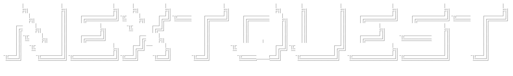

<br>

[](https://YOUR-LIVE-APP-URL)
   
[](https://huggingface.co/YOUR-HF-REPO)

A Steam-powered game recommendation web app that learns user taste from liked games and returns high-similarity suggestions with explainable profile data. NextQuest uses a multimodal retrieval pipeline (text + image + numeric features) with FAISS indexing, served through FastAPI and a React frontend.

<p>
  <a href="#overview"></a>
  <a href="#steam-data"></a>
  <a href="#training--artifact-build"></a>
  <a href="#local-usage"></a>
  <a href="#citations"></a>
  <a href="#license"></a>
</p>

## Overview
- SteamID-based flow with two game selection modes:
  - Steam Library
  - All Catalog Games
- Recommender excludes games already owned in the user’s library.
- Selection and recommendation cards support in-app profile modal previews.
- Profile modal includes metadata, score badges, description, and screenshots.
- Stack:
  - React (frontend)
  - FastAPI (backend)
  - FAISS + Sentence Transformers (retrieval/index)


## Steam Data
NextQuest uses Steam APIs for:
- owned library retrieval (profile dependent)
- app details metadata
- review snapshots
- current player counts
Notes:
- some profiles may be private or unavailable
- metadata completeness can vary by title

Note: This repository does not include runtime data; download the full \data/\` folder from the Hugging Face repo and place it at the project root (same level as \`frontend/\`, \`scripts/\`, and \`README.md\`) before running the app.`

## Training
If you want to rebuild the catalog and recommender artifacts locally:

```bash
conda env create -f environment.yml
conda activate nextquest

# Data collection and processing
python -m scripts.pipeline.collect_steam_game_data --seed-games-path data/seed_games_200.csv --raw-data-directory archive/archived_data/raw/steam --processed-data-directory data/processed --reviews-per-game 50

# Feature engineering and artifact building
python -m scripts.pipeline.build_recommender_features --games-path data/processed/games_catalog.parquet --reviews-path data/processed/reviews_catalog.parquet --features-path data/features/game_features.parquet

# Index building
python -m scripts.pipeline.build_game_genome_index --features-path data/features/game_features.parquet --artifacts-directory data/artifacts --images-per-game 3 --similar-games-count 30
```

## Local Usage
To run the app locally after building artifacts, you must run the backend and frontend separately:

```bash
# In one terminal, start the backend
uvicorn scripts.api.main:app --reload --port 8000

# In another terminal, start the frontend
cd frontend
npm install
node ./node_modules/vite/bin/vite.js
```

Open:
- Frontend: http://localhost:5173
- Backend: http://localhost:8000

Live App: https://YOUR-LIVE-APP-URL

## Citations
FAISS
@article{johnson2019billion,
  title={Billion-scale similarity search with GPUs},
  author={Johnson, Jeff and Douze, Matthijs and J{\'e}gou, Herv{\'e}},
  journal={IEEE Transactions on Big Data},
  year={2019}
}

Sentence-BERT / Sentence Transformers
@inproceedings{reimers2019sentence,
  title={Sentence-BERT: Sentence Embeddings using Siamese BERT-Networks},
  author={Reimers, Nils and Gurevych, Iryna},
  booktitle={EMNLP-IJCNLP},
  year={2019}
}

CLIP
@inproceedings{radford2021learning,
  title={Learning Transferable Visual Models From Natural Language Supervision},
  author={Radford, Alec and Kim, Jong Wook and Hallacy, Chris and et al.},
  booktitle={ICML},
  year={2021}
}

# License
This project is released under the MIT License.